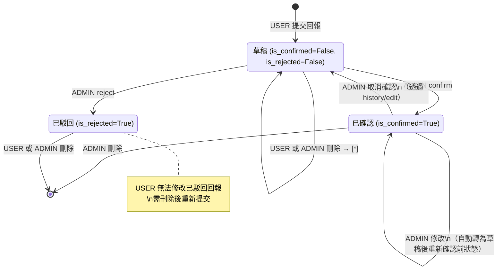
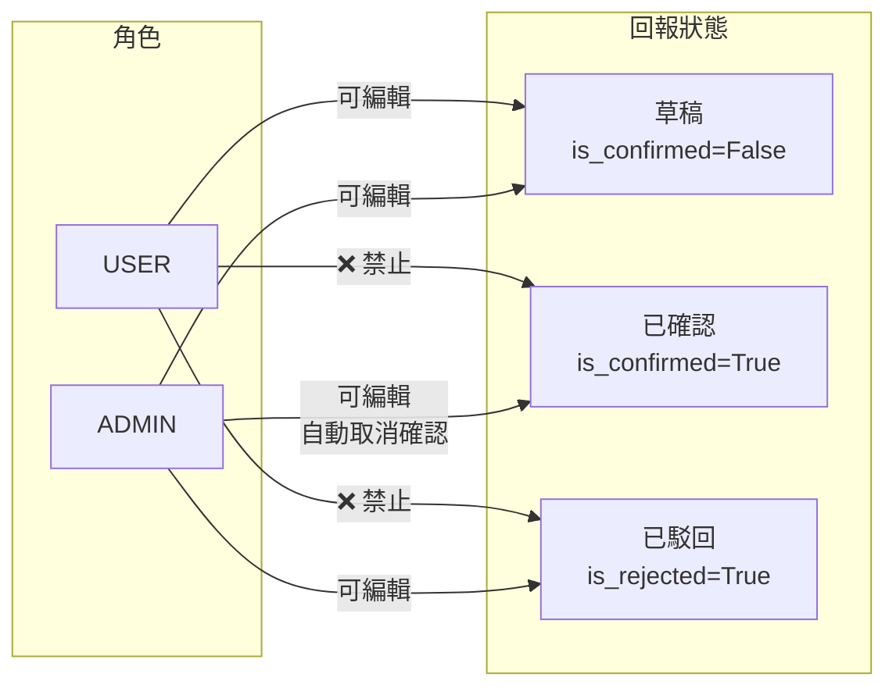
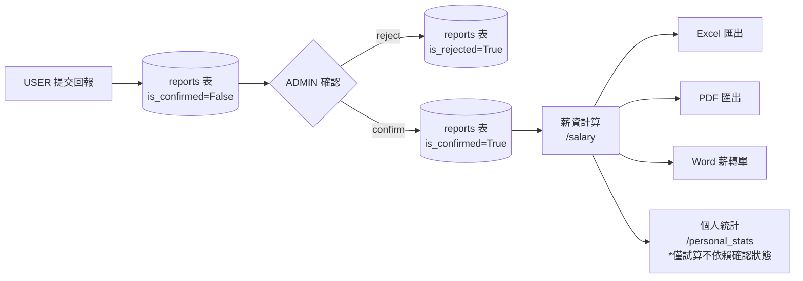
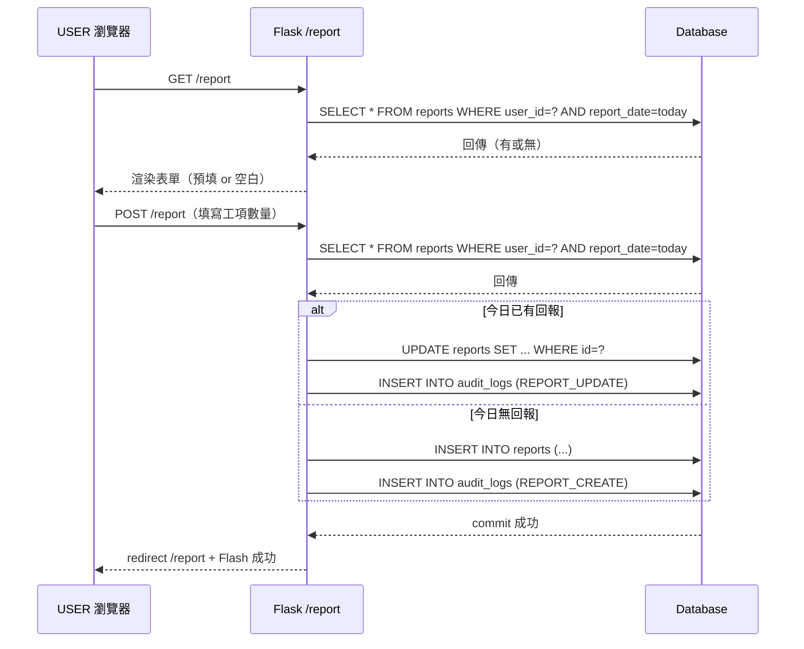
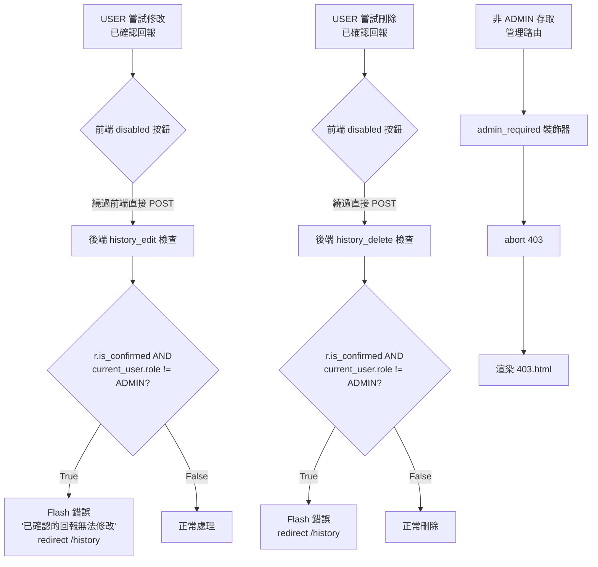

# 回報功能流程圖

> 涵蓋「回報頁面」、「歷史紀錄」、「確認頁面」三個功能模組的完整生命週期

---

## 主流程：回報的完整生命週期

```mermaid
flowchart TD
    START([使用者登入]) --> REPORT_PAGE

    subgraph REPORT_PAGE["📋 回報頁面 /report"]
        A1[GET /report] --> A2{今日是否已有回報?}
        A2 -->|有| A3[預填現有數值]
        A2 -->|無| A4[空白表單]
        A3 --> A5[填寫工項數量]
        A4 --> A5
        A5 --> A6[POST /report]
        A6 --> A7{今日已有紀錄?}
        A7 -->|有| A8[更新現有回報]
        A7 -->|無| A9[新增回報紀錄]
        A8 --> A10[add_audit REPORT_UPDATE]
        A9 --> A11[add_audit REPORT_CREATE]
        A10 --> A12[Flash 成功訊息]
        A11 --> A12
        A12 --> A1
    end

    subgraph HISTORY["📅 歷史紀錄 /history"]
        B1[GET /history] --> B2{角色?}
        B2 -->|USER| B3[查詢本人回報]
        B2 -->|ADMIN| B4[查詢所有帳戶回報\n含篩選條件]
        B3 --> B5[分頁顯示]
        B4 --> B5
        B5 --> B6{操作?}
        
        B6 -->|編輯| B7{已確認?}
        B7 -->|是 + USER| B8[❌ 拒絕 - 顯示 disabled 按鈕]
        B7 -->|否 或 ADMIN| B9[開啟編輯 Modal]
        B9 --> B10[POST /history/id/edit]
        B10 --> B11{是 ADMIN 且\n原先已確認?}
        B11 -->|是| B12[自動取消確認\nadd_audit REPORT_UNCONFIRM]
        B11 -->|否| B13[直接更新]
        B12 --> B14[更新欄位\nadd_audit REPORT_UPDATE]
        B13 --> B14
        B14 --> B15[Redirect /history]
        
        B6 -->|刪除| B16{權限檢查}
        B16 -->|USER 且已確認| B17[❌ 拒絕 - disabled 按鈕]
        B16 -->|USER 未確認 或 ADMIN| B18[confirm() 確認對話框]
        B18 --> B19[POST /history/id/delete]
        B19 --> B20[刪除回報\nadd_audit REPORT_DELETE]
        B20 --> B21[Redirect /history]
    end

    subgraph CONFIRM["✅ 確認頁面 /confirmation（ADMIN 專屬）"]
        C1[GET /confirmation] --> C2[查詢所有\n未確認且未駁回回報]
        C2 --> C3[顯示列表\n含帳戶/日期/工項明細]
        C3 --> C4{操作?}
        
        C4 -->|確認| C5[POST action=confirm]
        C5 --> C6[is_confirmed=True\nconfirmed_by=ADMIN\nconfirmed_at=now]
        C6 --> C7[add_audit REPORT_CONFIRM]
        C7 --> C8[Redirect /confirmation]
        
        C4 -->|駁回| C9[POST action=reject]
        C9 --> C10[is_rejected=True\nconfirmed_by=ADMIN\nconfirmed_at=now]
        C10 --> C11[add_audit REPORT_REJECT]
        C11 --> C8
    end

    REPORT_PAGE -->|查看歷史| HISTORY
    HISTORY -->|未確認回報待審| CONFIRM
    CONFIRM -->|確認後進入薪資計算| SALARY[💰 薪資計算\n已確認回報參與計算]
```

---

## 回報狀態機



---

## 回報編輯權限矩陣



---

## 回報資料流向（薪資計算）



---

## 回報頁面 GET/POST 詳細序列



---

## 錯誤處理路徑



---

*生成日期: 2026-06-30*
